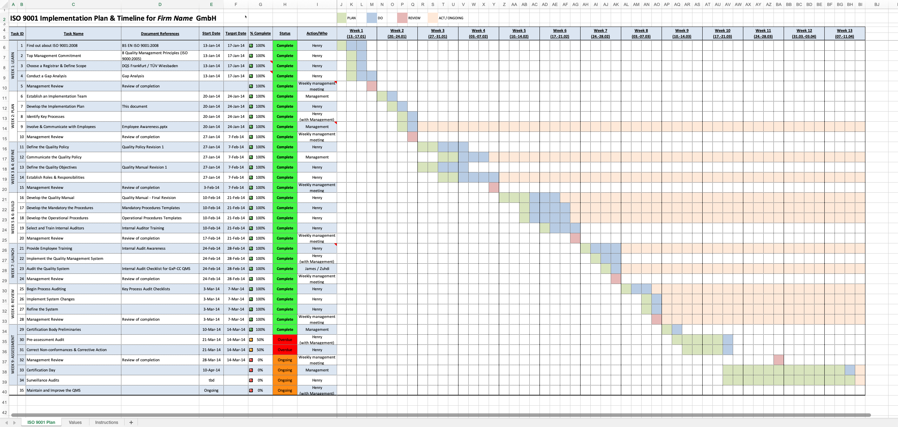
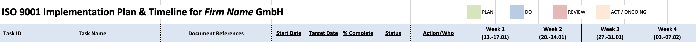
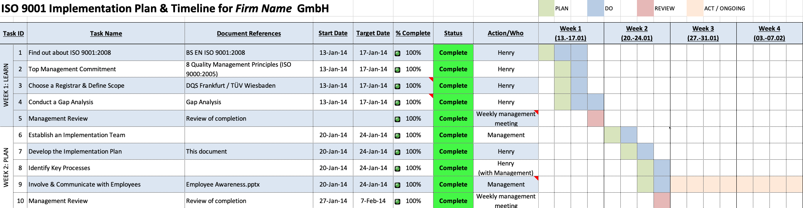

# User Requirements Specification for ISO 9001:2015 Planning Application (Version 01)

## 1. Introduction

This document outlines the user requirements for the ISO 9001:2015 Planning Application (Version 01), a web-based tool designed 
to replace the existing Excel-based system for planning and tracking ISO 9001:2015 implementation. The application provides a structured 
approach to managing the ISO 9001:2015 implementation process across multiple phases and tasks.
The Excel sheet formally used for an ISO implementation is shown below.

Figure 1 - Excel Sheet ISO 9001 Plan

## 2. Application Overview

The ISO 9001:2015 Planning Application is a browser-based tool that allows users to:
- Track the progress of ISO 9001:2015 implementation across 7 phases
- Manage individual tasks within each phase
- Record document references, start dates, and target dates for each task
- Track task status and completion percentages
- Assign responsibilities for task execution
- Plan activities across a 12-week timeline
- Save and load implementation plans

## 3. User Interface Requirements

### 3.1 General Layout

The application shall have the following layout components:
- The layout of the application is to be styled with Tailwind
- A header with the title "ISO 9001 Implementation Plan"
- A software version number with the actual version of the app e.g. for the first version '(vers. 01)'
- The version number is to appear on the same line as the title and with font-size of 16px
- A colour key indicating PLAN (#d9f2d9), EXECUTION (#d9e6f2), REVIEW (#f2d9da) and ONGOING (#f2e6d9)
- A control panel with buttons for adding tasks [green (#45a049) with white text], deleting tasks [red (#ff0000) with white text], saving plans [green with white text], 
clearing current plan [red with white text], and loading plans [green with white text]
- A horizontal line with column headings: TaskID | Task Name | Document Reference | Start Date | Target Date | % Complete | Status | Action/Who | Week 1 | Week 2 | Week 3 | Week 4 |
  - This line has a blue (#d9e6f2) background and slate-grey (#334155) text
  - Immediately below the individual weeks are the dates for that week - see Week 1, which has the working days of that week 13.-17.01
  - On opening the app only the first four weeks of the project are displayed.
  - The 'Task Name' and 'Document Reference' fields must be long enough to hold the following example text 'Task ID 7 | ISO 9001 Implementation Plan (this document)' without word wrap
- A main table area displaying the implementation plan

Figure 2 - Heading titles

### 3.2 Control Panel

The control panel shall include the following buttons:
- On starting the app no previous plan is loaded; to load a plan the user must choose 'Load Plan'
- Add Task: Allows users to add new tasks to the implementation plan
- Delete Task: Allows users to delete a task in the implement plan; none of the tasks loaded at start of app may be deleted, therefore 'Delete Task' button is greyed out until a new task is created.
- Newly created tasks by the user may be deleted, i.e. 'Delete Task' button is active
- If only one newly created user task exists and it is deleted 'Delete Task' button is greyed out again.
- Save Plan: Saves the current implementation plan to local storage
- Load Plan: Loads a previously saved implementation plan from local storage; no previously saved implementation plan is loaded on starting the app

### 3.3 Implementation Plan Table

The implementation plan table shall include the following columns:
- Task ID (split into Phase and Task Number)
- Task Name
- Document Reference
- Start Date
- Target Date
- % Complete
- Status
- Action / Who
- Weekly planning columns (4 weeks)

## 4. Data Structure Requirements

### 4.1 Phases

The application shall organize tasks into the following 7 phases:
Phase 1: LEARN
Phase 2: PLAN
Phase 3: DEFINE
Phase 4: BUILD
Phase 5: LAUNCH
Phase 6: REVIEW
Phase 7: ASSESSMENT

- The phases are to be placed in one column named Task ID. 
- The column itself is to have 2 vertical columns immediate under the column 'Task ID'
- In the left column the phases 1 to 7 are to be placed, whereby the phase names are to be vertical and reading from 
bottom to top they give the name of the phase, e.g. Phase 1: LEARN as shown below in Figure 3.

Figure 3 - Phases titles and weekly overview

### 4.2 Tasks

Each phase shall contain predefined tasks as follows:

#### Phase 1: LEARN
- Acquire BS EN ISO 9001:2015 and associated documents
- Top Management Commitment
- Choose a Registrar & Define Scope of Certification
- Conduct a Gap Analysis
- Management Review

#### Phase 2: PLAN
- Establish an Implementation Team
- Develop the Implementation Plan (this document)
- Identify Key Processes
- Involve & Communicate with Employees
- Management Review

#### Phase 3: DEFINE
- Define the Quality Policy
- Communicate the Quality Policy
- Define the Quality Objectives
- Establish Roles & Responsibilities
- Management Review

#### Phase 4: BUILD
- Develop the Quality Manual
- Develop the Mandatory Standard Operating Procedures
- Develop the Operational Procedures (Work Instructions)
- Select and Train Internal Auditors
- Execute Initial Internal Audit
- Develop Audit Reporting System
- Define Responsibilities
- Integration into QMS / SOPs / WIs
- Management Review

#### Phase 5: LAUNCH
- Provide Employee Training on all aspects of the QMS
- Implement the Quality Management System
- Formal Internal Audit the Quality System
- Management Review

#### Phase 6: REVIEW
- Begin Process Auditing
- Implement System Changes
- Refine the System
- Management Review

#### Phase 7: ASSESSMENT
- Certification Body Preliminaries
- Pre-assessment Audit
- Correct Non-conformances & Corrective Action
- Final Management Review
- Certification Day
- Surveillance Audits
- Maintain and Improve the QMS

### 4.3 Task Attributes

Each task shall have the following attributes:
- ID: A unique identifier for the task; the IDs for the tasks initially loaded on starting app run from 1 to 39
- Name: A descriptive name for the task
- Document Reference: A reference to associated documentation
- Start Date: The planned start date for the task
- Target Date: The planned completion date for the task
- Status: The current status of the task (Not Started, Overdue, Ongoing, Complete)
- Action/Who: The person or team responsible for the task

Document References
- The following 'Task IDs' must have the following corresponding 'Document Reference':
    - Task ID 1 | BS EN ISO 9001:2015
    - Task ID 2 | Quality Management Principles (ISO 9000:2005)
    - Task ID 3 | DQS Frankfurt / TÜV Wiesbaden
    - Task ID 4 | Gap Analysis
    - Task ID 5, Task ID 10, Task ID 15, Task ID 20, Task ID 24, Task ID 28, Task ID 32 | Review of Completion
    - Task ID 7 | ISO 9001 Implementation Plan (this document)
    - Task ID 9 | Exployee Awareness Presentation
    - Task ID 11 | Quality Policy Revision 1
    - Task ID 13 | Quality Manual Revision 1
    - Task ID 16 | Quality Manual - Final Revision
    - Task ID 17 | Mandatory Procedures Templates
    - Task ID 18 | Operational Procedures Templates
    - Task ID 19 | Internal Auditor Training
    - Task ID 21 | Internal Audit Awareness
    - Task ID 23 | Internal Audit Checklist for Company
    - Task ID 25 | Key Process Audit Checklists
- It must also be possible that the user be able to enter further document references for any of the tasks in the appropriate document reference field.

## 5. Functional Requirements

### 5.1 Task Management

The application shall allow users to:
- View all predefined tasks organized by phase
- Add new tasks to the implementation plan by right clicking on a task
  - the user then gets a choice if the new task is to be inserted above or below the task where the user clicked
  - the user must fill in the task text and any reference document
- Enter and edit document references for tasks
- Set start and target dates for tasks
  - no target date may be before the start date
- Update task status (Not Started, Overdue, Ongoing, Complete)
- Enter the names of the ISO Planning Project team members
- Assign responsibility for task execution
  - only project team members may be assigned responsibility for a task
  - the team members are chosen from a pull-down list

### 5.2 Progress Tracking

The application shall:
- Calculate and display the completion percentage for each phase based on task status
- Use the following point system for calculating completion:
  - Not Started/Overdue: 0 points
  - Ongoing: 5 points
  - Complete: 10 points
- Display completion percentages with color-coded indicators:
  - Less than 30%: Red
  - 30% to 90%: Yellow
  - Greater than >90%: Green
- When changes are made to the task status the completion percentage must be recalculated; this change must also be reflected in the % Complete column and the overall Phase status

### 5.3 Weekly Planning

The application shall:
- Display a 4-week timeline for planning task execution
- The start date will be the following Monday after the current date
- Below the columns marked with 'Week <em>n</em>' followed by a date, where <em>n</em> is a week number there should be:
  - 4 vertical columns, whereby each vertical column may be clicked on
  - on clicking a pull-down list with the choices
    - plan, execution, review, ongoing are displayed
- Allow users to mark activities in the weekly timeline using a four-section grid:
  - Plan (#d9f2d9)
  - Execution (#d9e6f2)
  - Review (#f2d9da)
  - Ongoing (#f2e6d9)
- Allow users to toggle the active state of each section by clicking and choosing from a pull-down list

### 5.4 Data Persistence

The application shall:
- Allow users to save the current implementation plan to local storage
- Allow users to load a previously saved implementation plan from local storage
- Automatically save changes to input fields when they are modified
- Offer users a possibility to clear all but the predefined fields of the table

## 6. Visual Design Requirements

### 6.1 General Styling

The application shall have:
- A clean, professional appearance with a white background
- A responsive layout that adapts to different screen sizes
- Consistent typography using Arial or sans-serif fonts
- Appropriate spacing and padding for readability

### 6.2 Color Scheme

The application shall use the following color scheme:
- Status indicators:
  - Not Started: Light red (#ffcccc)
  - Overdue: Red (#ff6666)
  - Ongoing: Light yellow (#ffeb99)
  - Complete: Light green (#b3ffb3)
- Weekly planning sections:
  - Plan: Light green (#d9f2d9)
  - Execution: Light blue (#d9e6f2)
  - Review: Light red (#f2d9d9)
  - Ongoing: Light orange (#f2e6d9)
- Phase cells: Light gray (#e6e6e6)
- Completion percentage indicators:
  - Less than 30%: Red (#ff6666)
  - 30% to 80%: Yellow (#ffcc00)
  - Greater than 80%: Green (#4CAF50)

### 6.3 Table Styling

The implementation plan table shall:
- Have a fixed header row with column titles
- Display phase names vertically in the leftmost column
- Use alternating row colors for improved readability
- Have appropriate borders and cell padding
- Include horizontal scrolling for the weekly columns when needed

## 7. Technical Requirements

### 7.1 Browser Compatibility

The application shall be compatible with:
- Google Chrome (latest version)
- Mozilla Firefox (latest version)
- Microsoft Edge (latest version)
- Safari (latest version)

### 7.2 Responsiveness

The application shall:
- Be usable on desktop and laptop computers
- Provide horizontal scrolling for the table on smaller screens
- Maintain readability and usability at different screen sizes

### 7.3 Performance

The application shall:
- Load quickly in standard web browsers
- Respond promptly to user interactions
- Handle the complete set of phases and tasks without performance degradation

## 8. Limitations and Constraints

The Version 01 application has the following limitations:
- Data is stored only in the browser's local storage
- No multi-user collaboration features
- No cloud synchronization
- Limited to 12 weeks of planning
- No ability to add custom phases (only custom tasks)
- No printing or export functionality